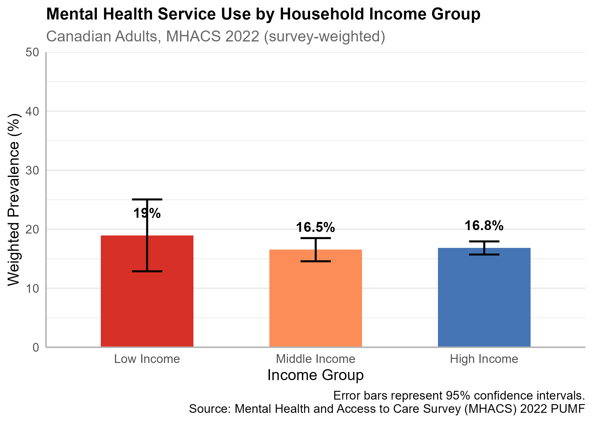
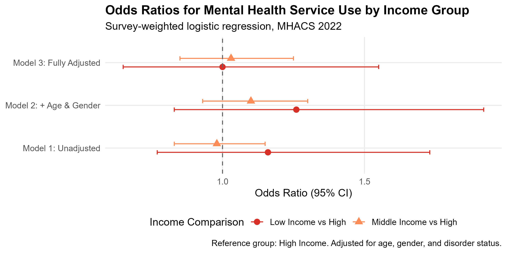
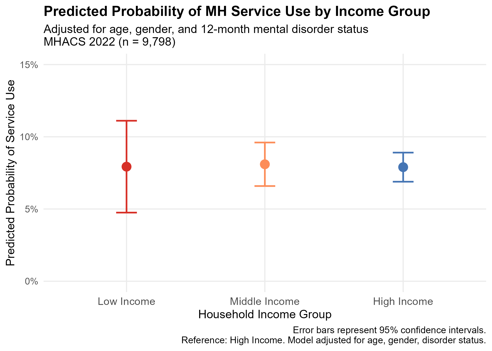
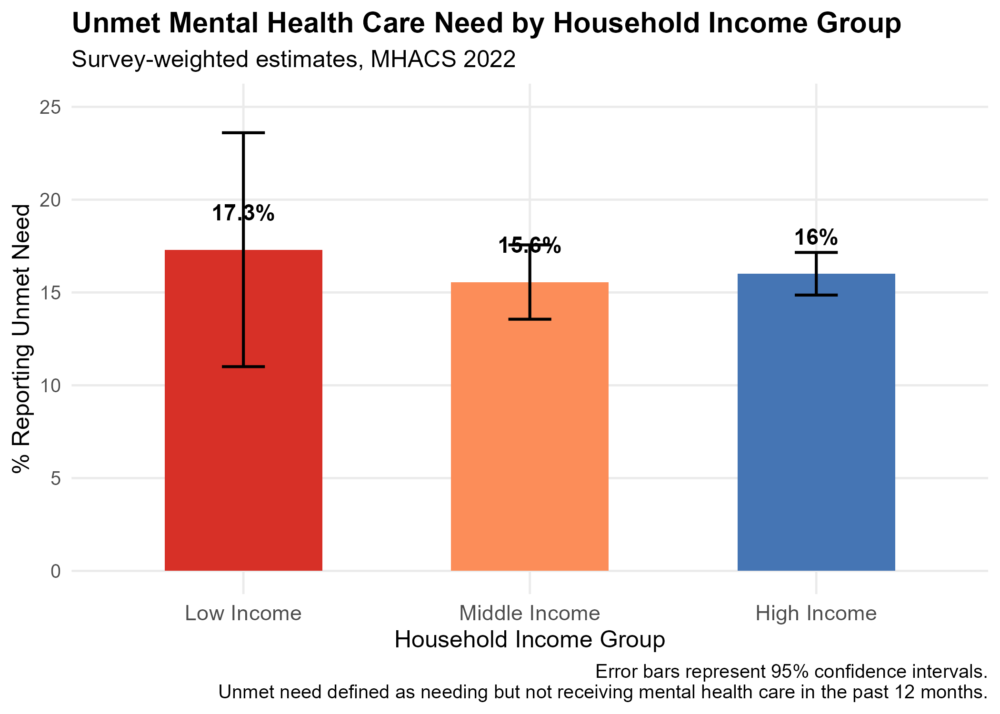
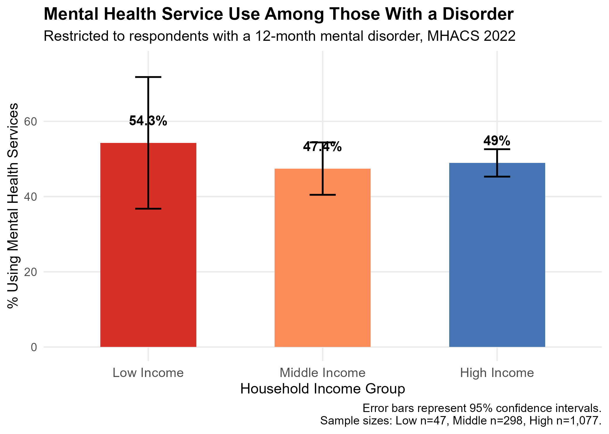

```{r}
#| label: setup
#| include: false

library(tidyverse)
library(survey)
library(srvyr)
library(knitr)
library(kableExtra)

mhacs_clean <- read_rds("data_clean/mhacs_clean.rds")

mhacs_clean2 <- mhacs_clean %>%
  mutate(
    inc3 = case_when(
      inc_hh %in% 1:5   ~ "low",
      inc_hh %in% 6:10  ~ "middle",
      inc_hh %in% 11:15 ~ "high",
      TRUE ~ NA_character_
    ),
    inc3 = factor(inc3) %>% relevel(ref = "high")
  )

svy_overall    <- read_csv("outputs/svy_overall.csv",            show_col_types = FALSE)
svy_chars      <- read_csv("outputs/svy_chars.csv",              show_col_types = FALSE)
or_all_models  <- read_csv("outputs/or_all_models.csv",          show_col_types = FALSE)
pred_df        <- read_csv("outputs/predicted_probs.csv",        show_col_types = FALSE)
svy_disorder   <- read_csv("outputs/svy_disorder_subgroup.csv",  show_col_types = FALSE)
svy_inc3_unmet <- read_csv("outputs/svy_inc3_unmet.csv",         show_col_types = FALSE)
```

------------------------------------------------------------------------

## Introduction

Mental health disorders affect approximately one in five Canadians each year, yet access to professional mental health services remains unequally distributed across the population[@CIHI2025]. Socioeconomic factors, particularly household income, are widely recognized as determinants of healthcare access, with lower-income individuals facing barriers such as out-of-pocket costs, reduced availability of services, and lower health literacy[@PHAC2022][@StatCan2023].

Canada's publicly funded healthcare system theoretically provides universal access to essential health services; however, mental health care falls outside the scope of provincial insurance plans in many cases, creating potential for income-based disparities[@CIHI2024][@PHAC2024]. Despite this, the empirical evidence on income-related inequities in mental health service utilization within Canada remains limited, particularly using recent nationally representative data[@CIHI2024][@PHAC2022].

This study uses data from the 2022 Mental Health and Access to Care Survey (MHACS), a nationally representative cross-sectional survey conducted by Statistics Canada, to examine whether household income predicts mental health service use among Canadian adults[@StatCan2022survey]. Three sequential logistic regression models are used to assess this association before and after adjustment for key sociodemographic and clinical covariates.

## Methods

### Data Source

The MHACS targeted Canadians aged 15 years and older residing in the ten provinces, excluding individuals living in institutions, on reserve, or in the three territories[@StatCan2022survey][@StatCanMHACS].The reference period for most survey questions was the 12 months preceding the interview. The public use microdata file (PUMF) was used for this analysis.

### Survey Design and Weighting

The MHACS employed a complex multi-stage sampling design. All analyses incorporated the master survey weight ('WTS_M') and bootstrap-replicated weights to produce population-representative estimates and valid standard errors. The `survey`[@Lumley2026][@Lumley2004] and `srvyr` [@FreedmanEllis2026] packages in R (v4.5.0) were used for all weighted analyses.

### Variables

The primary exposure was household income. The derived variable 'INCDVHH', provided in the MHACS PUMF, contains 15 ordered income categories [@StatCan2022survey]. For this analysis, these categories were collapsed into three groups: low (1-5), middle (6-10), and high (11-15), consistent with income groupings used in prior analyses of Canadian health survey data [@StatCan2023]. High income served as the reference group.

This grouping resulted in unequal sample sizes among respondents with a mental disorder (low: n=47; middle: n=298; high: n=1,077). The imbalance reflects the income distribution in the MHACS sample and aligns with known patterns in Canada, where higher-income households are more frequently captured in surveys. Consequently, estimates for the low-income group have wider confidence intervals and should be interpreted with caution. Sensitivity to this limitation is discussed in the Limitations section. Covariates included age group, sex/gender, and 12-month mental disorder diagnosis (any disorder: yes/no). Age group and sex/gender were included to account for demographic differences in service use, while diagnosis was included to adjust for differential need across income groups.

### Statistical Analysis

Survey-weighted logistic regression was conducted using the 'svyglm()' function[@Lumley2026].Three sequential models were built: Model 1 (unadjusted) examined the crude association between income and service use; Model 2 added age group and gender; Model 3 further adjusted for 12-month mental disorder status. Results are reported as odds ratios (OR) with 95% confidence intervals. A supplementary analysis restricted the sample to respondents with a 12-month mental disorder to examine service use conditional on need.

## Results

### Sample Characteristics

```{r}
#| label: tbl-chars
#| tbl-cap: "Mental health service use and unmet need by income group, MHACS 2022"

svy_chars %>%
  filter(!is.na(inc3)) %>%
  mutate(
    inc3 = case_when(
      inc3 == "low"    ~ "Low Income",
      inc3 == "middle" ~ "Middle Income",
      inc3 == "high"   ~ "High Income"
    ),
    pct_service = paste0(round(pct_service * 100, 1), "%"),
    pct_unmet   = paste0(round(pct_unmet * 100, 1), "%")
  ) %>%
  select(inc3, n, pct_service, pct_unmet) %>%
  arrange(factor(inc3, levels = c("Low Income", 
                                   "Middle Income", 
                                   "High Income"))) %>%
  kable(
    col.names = c("Income Group", "N",
                  "% Using Services", "% Unmet Need"),
    align = c("l", "r", "r", "r")
  ) %>%
  kable_styling(bootstrap_options = c("striped", "hover"),
                full_width = FALSE)
```

As shown in Table 1, weighted service use rates were similar across income groups, ranging from 16.5% (middle income) to 19.0% (low income). Unmet need was highest among low-income respondents (17.3%) compared to middle (15.6%) and high-income groups (16.0%).

### Mental Health Service Used by Income Group

```{r}
#| label: fig-service-use
#| fig-cap: "Weighted mental health service use by household income group, MHACS 2022"
#| fig-width: 7
#| fig-height: 5


```

Crude service use rates varied modestly across income groups (Figure 1). Low-income respondents reported the highest rate of service use (19.0%), though confidence intervals were wide given the smaller sample size in this group (n=297).

### Logistic Regression Results

```{r}
#| label: fig-forest
#| fig-cap: "Odds ratios for mental health service use by income group across three regression models, MHACS 2022"
#| fig-width: 8
#| fig-height: 5


```

Across all three models, low-income respondents showed higher odds of service use compared to high-income respondents, though confidence intervals were wide (Figure 2). Results were consistent before and after adjustment for age, gender, and mental disorder status.

### Predicted Probabilities

```{r}
#| label: fig-pred
#| fig-cap: "Predicted probability of mental health service use by income group, MHACS 2022"
#| fig-width: 7
#| fig-height: 5


```

Predicted probabilities from Model 3 confirmed modest differences across income groups after full adjustment (Figure 3).

### Unmet Mental Health Need

```{r}
#| label: fig-unmet
#| fig-cap: "Weighted prevalence of unmet mental health need by income group, MHACS 2022"
#| fig-width: 7
#| fig-height: 5


```

Unmet need was highest among low-income respondents (17.3%), suggesting that despite similar rates of service use, lower-income Canadians experience greater gaps in care (Figure 4).

### Subgroup Analysis: Respondents with a Mental Disorder

```{r}
#| label: fig-subgroup
#| fig-cap: "Mental health service use by income group among respondents with a 12-month mental disorder, MHACS 2022"
#| fig-width: 7
#| fig-height: 5


```

Among respondents with a diagnosed mental disorder, income gradients in service use were more pronounced (Figure 5), consistent with need-based access barriers in lower-income groups.

## Discussion

### Summary of Key Findings 

This study found that mental health service use did not differ dramatically across income groups in the 2022 MHACS sample, with service use ranging from about 16.5% to 19.0% across low-, middle-, and high-income households. However, unmet mental health need was consistently higher among low-income respondents, and income gradients in service use were more pronounced among those with a diagnosed mental disorder, suggesting inequities conditional on need. 

### Comparison With Previous Literature

The pattern of higher unmet need and greater barriers among lower-income Canadians is consistent with national surveillance reports describing income-related inequalities in mental health and access to care [@PHAC2022][@PHAC2024]. Similar to prior work using MHACS and related national surveys, this study indicates that universal coverage under Medicare does not fully eliminate socioeconomic differences in mental health service utilization [@StatCan2023].

### Strengths and Limitations

Key strengths of this study include the use of a large, nationally representative survey with detailed information on both mental health status and service use, and the application of survey-weighted regression methods that account for the complex sampling design [@StatCan2022survey] [@StatCanBootstrap].

However, several limitations should be noted. First, all measures are self-reported and may be subject to recall or social desirability bias. Second, the cross-sectional design precludes causal inference about the relationship between income and service use. Third, the relatively small number of low-income respondents with a diagnosed mental disorder leads to imprecise estimates in this subgroup, as reflected in the wide confidence intervals. 

### Implications for Policy and Practice

The finding that unmet need is highest among low-income respondents, despite similar overall service use rates, highlights the importance of addressing financial and structural barriers to care. Policy initiatives that expand publicly funded psychotherapy, reduce out-of-pocket costs, and enhance community mental health services in lower-income areas may help reduce income-related inequities [@CIHI2024][@PHAC2022].

### Conclusion

In this analysis of the 2022 Mental Health and Access to Care Survey, household income was associated with unmet mental health need and, among those with a disorder, with mental health service use. These findings underscore the persistence of income-based inequalities in access to mental health care in Canada and emphasize the need for targeted policy responses. 

## References